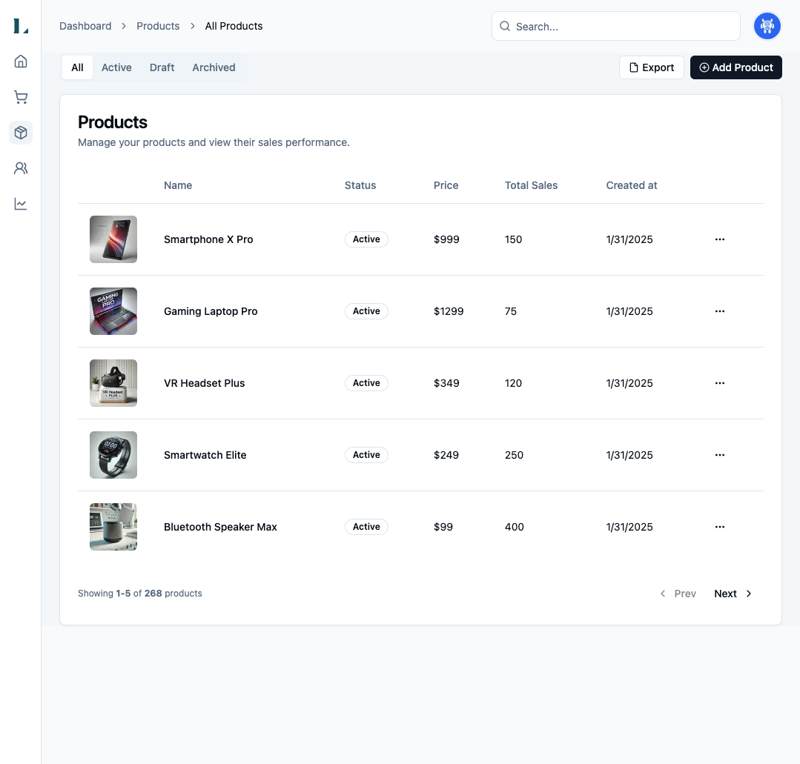

<h1 style="text-align: center; margin:0;">Front-end coding exercise</h1>
<br />

For this exercise, we will be adding some features/functionality to an example dashboard application. Many
features/pages have not been implemented yet, so it's expected that some buttons/links in the app do not do anything.

The goal is to
simulate a somewhat realistic situation that you may encounter while working at Langston. You are welcome to use any
tools you'd like, including Google searches, AI Assistance (chatGPT, cursor, etc).

Please do your best to communicate your thought process as you go along. Feel free to ask questions.

Follow the instructions in **Project Setup** to get up and running, then work through implementing the items in the
**Tasks** section.

<!-- toc -->

- [Overview](#overview)
- [Project setup](#project-setup)
  * [Installation](#installation)
  * [Create seed data](#create-seed-data)
  * [Start the application](#start-the-application)
- [API Routes](#api-routes)
- [Tasks](#tasks)
  * [Edit a product](#edit-a-product)
  * [Create a product](#create-a-product)
  * [View product detail page](#view-product-detail-page)
  * [Ensure only Admin users can edit a project](#ensure-only-admin-users-can-edit-a-project)
  * [Add an option to change the page size on the Products table](#add-an-option-to-change-the-page-size-on-the-products-table)
  * [View my account settings](#view-my-account-settings)
  * [Show a confirmation message before deleting a product](#show-a-confirmation-message-before-deleting-a-product)

<!-- tocstop -->

## Overview

This codebase uses the following stack:

- Framework - [Next.js (App Router)](https://nextjs.org)
- Language - [TypeScript](https://www.typescriptlang.org)
- Auth - [Auth.js](https://authjs.dev)
- Database - [Sqlite with Drizzle ORM](https://orm.drizzle.team/docs/get-started-sqlite)
- Styling - [Tailwind CSS](https://tailwindcss.com)
- Components - [Shadcn UI](https://ui.shadcn.com/)
- Analytics - [Vercel Analytics](https://vercel.com/analytics)
- Formatting - [Prettier](https://prettier.io)



*A screenshot of the application*

## Project setup

### Installation

First, ensure you have Node 18 (or higher) installed.

> [!TIP]
> [Node Version Manager (nvm)](https://github.com/nvm-sh/nvm) is a great tool to easily manage multiple
> versions of node
> via the command line

Next, install the project's dependencies.

```bash
npm install
```

### Create seed data

For simplicity, this project is using SQLite, which is a file system based SQL database, running on your local machine.

To have some real data to use in the application, we'll need to run a script to seed the database:

```bash
npm run db:seed
```

This will execute the script in `database/connect.ts`. Once this has completed, you should see the data file
`database/collection.db`.

### Start the application

Finally, run the following commands to start the development server:

```bash
npm run dev
```

You should now be able to access the application at http://localhost:3000.

## API Routes

This project has a couple API routes that you are welcome to use. These are defined as Next.js `routes` in the `api` directory. 

| Method | Path                        | Description                | Response                                                                                         |
|--------|-----------------------------|----------------------------|--------------------------------------------------------------------------------------------------|
| `POST` | `/api/products`             | Create a new product       | 201: Newly created product data<br>400: Payload validation error<br>500: Unexpected Server error |
| `PUT`  | `/api/products/:product_id` | Update an existing product | 200: Updated product data<br>400: Payoad validation error<br>500: Unexpected server error        |

## Tasks

You may work on these tasks in any order you'd like. While developing, keep in mind that all features should work well
on screen sizes.

### Edit a product

As a user, I need to be able to edit the details of a project: the projects name, status, imageUrl, price and stock.
Currently, the in the product table view, there is button to Edit a product, but it doesn't do anything.

### Create a product

As a user, I want to add create new product and be able to see it in the Product list.

### View product detail page

As a user, I want to view the details of a product on its own page. The detail page should present all the
information about a product: name, status, imageUrl, price, stock and image.

### Ensure only Admin users can edit a project

As a user, I must have the appropriate permissions in order to edit a project. If I do not have the proper permissions,
I should not be able to access the edit functionality.
For testing, you can log in as an admin using the following credentials:

```bash
# 'admin' credentials
email: admin@test.com
password: testing

# 'customer' credentials
email: test@example.com
password: testing
```

### Add an option to change the page size on the Products table

As a user, I want to choose a different page size to view more/fewer products at a time. The current default is 5 per
page.

### View my account settings

As a user, I want to be able to access my account settings. There is not currently a page built for this, but there is a
link in the User dropdown menu.

### Show a confirmation message before deleting a product

As a user, I want to have a chance to confirm I want to delete a product in case I pushed the button on accident.
